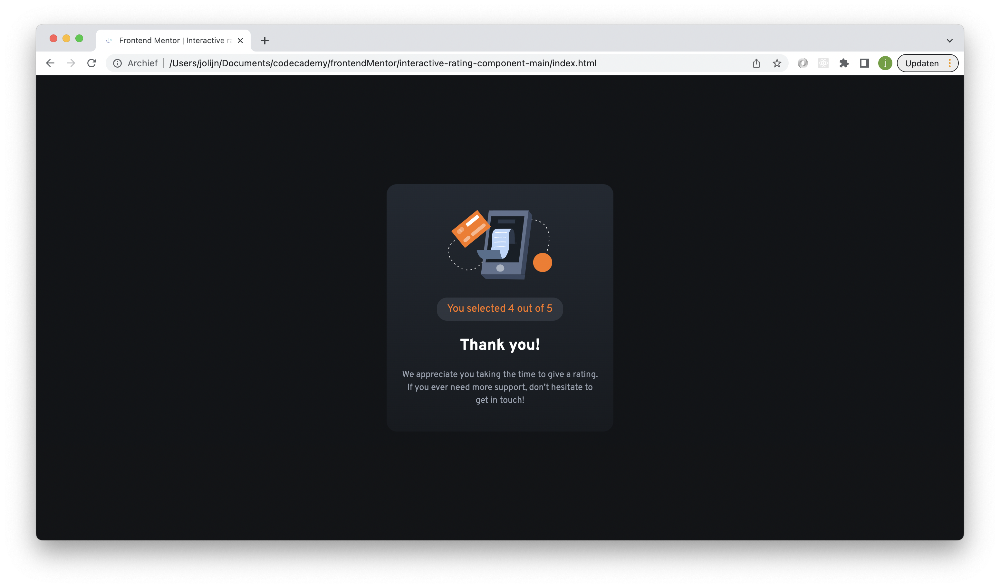

# Frontend Mentor - Interactive rating component

This rating component was a challenge on Frontend Mentor. For more information about frontend Mentor [click here.](https://www.frontendmentor.io/challenges/interactive-rating-component-koxpeBUmI)

## The challenge

The challenge was making a interactive rating component were people could rate for example a bussines from one to five stars. after someone has submit there rating you will see a thank you text with the chosen rating. The gave me a few jpg files with screenshots how the component and how the active-states should look like. There was also a styleguide with the colors and font for the project.

## Screenshots

## My experience

This was a good practice for making a project as close as possible to the sketches of someone else. I practised with the em and rem units in css. It was fun to make the interactions work with javascript.

### Links

- Solution URL: [github repository](https://github.com/Jolijn0101/Interactive-rating-component)
- Live Site URL: [github page](https://jolijn0101.github.io/Interactive-rating-component/)
